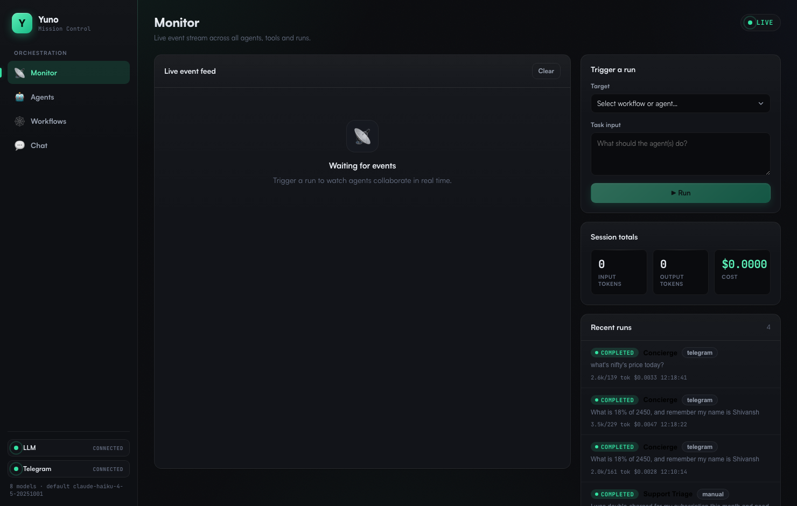
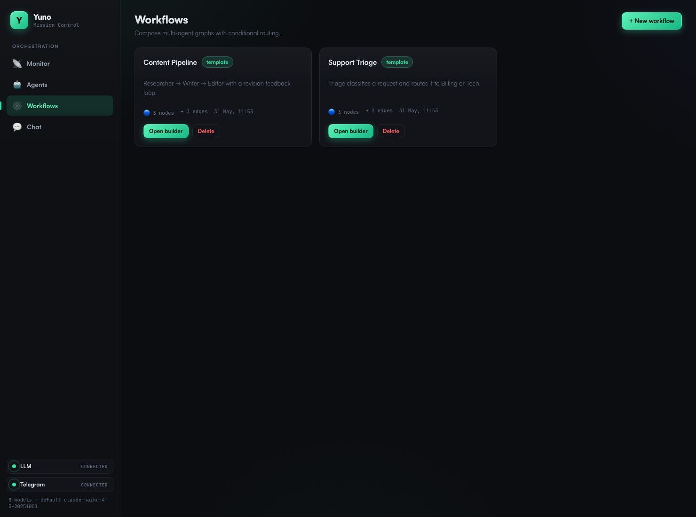

# Yuno Agent Orchestration Platform

A platform to **create AI agents**, configure how they behave (personality, tools,
memory, schedules, guardrails, limits), and wire them into **collaborative
multi-agent workflows** that run on a **real runtime** (LangGraph). Agents execute
real tools, hand work to each other asynchronously, and at least one agent is
reachable from **Telegram** so a human can talk to it conversationally. Everything
is managed from a web UI with **live monitoring** (logs, inter-agent messages,
token/cost), and the whole thing runs locally with **one command**.

> Built for the Yuno AI Engineer hiring challenge.

### 🔗 Live demo: **https://yuno-agent-orchestration-zkju.onrender.com**
*(Hosted on Render's free tier — the first request after idle may cold-start for ~30–60s, then it's instant.)*




---

## 1. What it does (mapped to the brief)

| Requirement | Where it lives |
|---|---|
| Agent CRUD: name, role, system prompt, model, tools, channels | `backend/app/api/agents.py`, UI **Agents** tab |
| Agent config: schedules, memory, skills, interaction rules, guardrails, limits | `Agent` model (`models.py`), agent editor |
| Real runtime executing agent logic (not a mockup) | `backend/app/runtime/engine.py` — LangGraph + `create_react_agent` |
| Real tools | `backend/app/runtime/tools.py` — web search, HTTP, calculator, time, durable memory |
| Agents communicate **asynchronously** | `runtime/bus.py` (event bus) + graph hand-offs; agents never call each other directly |
| Visual workflow builder with **conditions + feedback loops** | UI **Workflows** tab (React Flow) → compiled to a LangGraph `StateGraph` |
| ≥ 2 prebuilt workflow templates | `backend/app/templates/seed.py` — *Content Pipeline* (feedback loop) + *Support Triage* (conditional routing) |
| External channel (WhatsApp / Telegram / Slack) | **Telegram** via long-polling — `backend/app/channels/telegram.py` |
| Message history persisted + visible in UI | unified `Message` table; **Monitor** + **Chat** tabs |
| Live monitoring: logs, inter-agent messages, token/cost | `/ws/monitor` WebSocket → **Monitor** tab |
| Runs fully local, single setup command | `docker compose up --build` |
| Clean UI / runtime / persistence separation | `app/api` ↔ `app/runtime` ↔ `app/db`+`app/models` |
| Tests for critical paths | `backend/tests/test_critical_paths.py` |

---

## 2. Architecture

```
                         ┌───────────────────────────────────────────┐
                         │                Web UI (React)             │
                         │  Agents · Workflows(React Flow) · Monitor │
                         │              · Chat                        │
                         └───────▲───────────────────────▲───────────┘
                          REST / │ JSON          WebSocket│ /ws/monitor
                                 │                        │ (live events)
        ┌────────────────────────┴────────────────────────┴───────────────┐
        │                       FastAPI  (app/api/*)                       │
        │   agents · workflows · runs · chat · messages · ws               │
        └───────┬───────────────────────────────────────────┬─────────────┘
                │                                             │
   ┌────────────▼─────────────┐                  ┌────────────▼─────────────┐
   │   Agent Runtime          │   async events   │     Channels             │
   │   (app/runtime, LangGraph)│◄────────────────►│  Telegram (long-poll)    │
   │  • run_agent (ReAct+tools)│   EventBus       │  app/channels/*          │
   │  • run_workflow (StateGraph: conditions, loops)                        │
   │  • tools · memory · llm (token/cost)         │                         │
   └────────────┬─────────────┘                  └────────────┬────────────┘
                │                                             │
        ┌───────▼─────────────────────────────────────────────▼───────────┐
        │            Persistence  (SQLModel + SQLite)                      │
        │   Agent · Workflow · Run · Message · MemoryItem                  │
        └──────────────────────────────────────────────────────────────────┘
```

**Three clean layers**, as the brief requires:
- **UI layer** — React SPA (`frontend/`) + FastAPI routers (`app/api/`). The API is the only contract between them.
- **Agent runtime** — `app/runtime/`. Knows nothing about HTTP. Compiles stored
  workflow graphs into LangGraph `StateGraph`s and executes ReAct agents.
- **Data / persistence** — `app/models.py` + `app/db.py`. SQLModel ORM over SQLite.

**How a multi-agent workflow runs:** a stored graph (`{nodes, edges, entry}`) is
compiled into a LangGraph `StateGraph`. Each **node** is an agent run as a real
ReAct loop (`create_react_agent`) with its own model, system prompt, tools and
memory. Each **edge** carries a condition (`always`, `contains:WORD`,
`not_contains:WORD`); these become LangGraph **conditional edges**. A **back-edge**
(e.g. Editor → Writer while the reply contains `REVISE`) is a real **feedback
loop**, bounded by a per-node visit cap and a global recursion limit. Every
hand-off is persisted as a `Message` and pushed to the live monitor over the
EventBus — that decoupling is what makes agent-to-agent communication
**asynchronous**.

---

## 3. Tech & runtime choices (and why)

- **Runtime — LangGraph.** The brief explicitly asks for a *visual workflow builder
  with conditions and feedback loops* on a *real runtime*. LangGraph models exactly
  that: a graph of nodes with conditional edges and cycles. The UI graph maps 1:1
  onto a `StateGraph`, so the picture the user draws **is** the executable program —
  no translation gap. Agent nodes use LangGraph's prebuilt `create_react_agent`, a
  genuine tool-executing ReAct loop (not a single prompt). Alternatives considered:
  CrewAI (great for linear "crews" but conditions/loops are less first-class) and a
  custom runtime (more control, but reinventing routing/recursion safety I'd get
  for free).
- **LLM — multi-provider (Anthropic + AWS Bedrock).** The runtime derives the
  provider from each agent's model id (`provider_for_model`), so agents can mix
  **Claude** (`langchain-anthropic`) and **Bedrock** models — Amazon Nova / Meta
  Llama via `langchain-aws` with bearer-token auth (`ChatBedrockConverse`). Pick a
  model per agent in the UI; `DEFAULT_MODEL` sets what seeded agents use. Token
  usage from `usage_metadata` drives real cost tracking for both. Verified live:
  Nova Lite runs the full Content Pipeline (real tools + feedback loop) end-to-end
  for < $0.001. See ADR-0008.
- **Channel — Telegram** via **long-polling** (`getUpdates`). It needs **no public
  webhook or hosting** — it works behind a laptop firewall, which is ideal for a
  local-first demo. WhatsApp needs Meta Business verification; Slack needs a
  workspace + app config. Telegram is the lowest-friction path to "talk to your
  agent from your phone." The `Channel` base class makes adding Slack/WhatsApp a
  small, well-scoped change.
- **Backend — FastAPI** (async-native: WebSockets, background runs, async LLM
  calls all in one model) + **SQLModel/SQLite** (zero-setup, file-based, fully
  local; one `DATABASE_URL` swap to move to Postgres).
- **Frontend — React + Vite + TypeScript**, with **React Flow** for the builder.

---

## 4. Quickstart (single command)

**Prereqs:** Docker. (For dev without Docker, see §6.)

```bash
cp .env.example .env
#  → configure ONE LLM provider (required to run agents):
#      • AWS Bedrock: set AWS_BEARER_TOKEN_BEDROCK (+ DEFAULT_MODEL=us.amazon.nova-lite-v1:0)
#      • or Anthropic: set ANTHROPIC_API_KEY (+ DEFAULT_MODEL=claude-haiku-4-5-20251001)
#  → (optional) paste TELEGRAM_BOT_TOKEN for the Telegram demo

docker compose up --build
```

Open **http://localhost:8000**. The database is seeded automatically with 7 agents
and the 2 workflow templates, so you can run a multi-agent workflow within seconds.

> No API key yet? The UI still loads and you can create/configure agents and build
> workflows; you just can't execute them until `ANTHROPIC_API_KEY` is set.

---

## 5. Telegram setup (2 minutes)

1. In Telegram, message **@BotFather** → `/newbot` → follow prompts → copy the token.
2. Put it in `.env`: `TELEGRAM_BOT_TOKEN=123456:ABC...`
3. (Optional) `TELEGRAM_DEFAULT_TARGET=Concierge` (an agent **or** workflow name).
4. `docker compose up --build`, then open Telegram and message your bot. Try:
   *"What's 18% of 2,450, and remember my project is called Atlas."* The **Concierge**
   agent will use the calculator + memory tools and reply. Every turn appears in the
   **Monitor** tab live and is stored in history.

---

## 6. Local dev (hot reload)

```bash
# Terminal 1 — backend (FastAPI on :8000)
cd backend
python3 -m venv .venv && .venv/bin/pip install -r requirements.txt
echo "ANTHROPIC_API_KEY=sk-ant-..." > .env       # backend reads ./.env
.venv/bin/uvicorn app.main:app --reload --port 8000

# Terminal 2 — frontend (Vite on :5173, proxies /api + /ws to :8000)
cd frontend
npm install && npm run dev
```

Open http://localhost:5173. (`make backend` / `make frontend` do the same.)

---

## 7. Demo script (for the recorded video)

1. **Agents tab** — open *Editor* agent; show the full config surface (model,
   tools, memory, interaction rules, guardrails, limits). Create a new agent live.
2. **Workflows tab** — open *Content Pipeline*; point out the feedback loop edge
   (Editor → Writer, condition `contains:REVISE`). Hit **Run** with a topic.
3. **Monitor tab** — watch the live feed: Researcher uses `web_search`, Writer
   drafts, Editor returns `REVISE:` → loop back to Writer → `APPROVED:` → done.
   Show the running **token/cost** tally and the run's status badge.
4. **Support Triage** — run it twice (a billing question, a bug report) to show
   **conditional routing** to different agents.
5. **Telegram** — from your phone, message the bot; show the reply, and the same
   conversation appearing in the **Monitor**/**Chat** tabs (persisted history).

---

## 8. Project structure

```
yuno-agent-platform/
├── docker-compose.yml         # single-command run
├── Dockerfile                 # multi-stage: build UI → serve from backend
├── Makefile                   # up / dev / backend / frontend / test
├── .env.example
├── backend/
│   ├── requirements.txt
│   └── app/
│       ├── main.py            # FastAPI app, lifespan (db, seed, telegram)
│       ├── config.py          # env-driven settings + model price table
│       ├── db.py              # SQLite engine + sessions
│       ├── models.py          # Agent · Workflow · Run · Message · MemoryItem
│       ├── schemas.py         # API request/response contracts
│       ├── api/               # agents · workflows · runs · messages · ws
│       ├── runtime/           # LANGGRAPH RUNTIME
│       │   ├── engine.py      #   run_agent + run_workflow (StateGraph)
│       │   ├── tools.py       #   real tools
│       │   ├── memory.py      #   durable + conversation memory
│       │   ├── llm.py         #   Anthropic client + token/cost
│       │   └── bus.py         #   async event bus + message recorder
│       ├── channels/          # telegram.py (+ base.py abstraction)
│       └── templates/seed.py  # 2 workflow templates + agents
│   └── tests/                 # critical-path tests
└── frontend/                  # React + Vite + TS (Agents/Workflows/Monitor/Chat)
```

---

## 9. Extending the platform

**Add a tool:** write a function in `runtime/tools.py`, wrap it with `@tool`, and
register it in `TOOL_REGISTRY` (or `_build_memory_tools` for agent-scoped tools).
It immediately appears in the agent editor's tool picker (via `/api/meta`).

**Add a workflow template:** append an `Agent`/`Workflow` to `templates/seed.py`
using the `{entry, nodes, edges}` graph shape (edges may include `condition` and
may point backwards to form a feedback loop). Or just build one in the UI and save.

**Add a messaging channel (e.g. Slack):** implement `Channel` in
`channels/slack.py` (`start`/`stop`), turn inbound messages into a run via
`dispatch_inbound(text, channel="slack", session_ref=..., target=...)`, send the
returned reply back, and start it in `main.py`'s lifespan. The runtime, persistence
and history are reused unchanged.

---

## 10. Testing

```bash
cd backend && .venv/bin/python -m pytest -q
```

Covers the critical paths called out in the brief — **agent creation** (CRUD API),
**workflow execution** (conditional routing **and** the feedback loop, with the LLM
mocked so it runs offline), and **message delivery** (persistence + live bus
fan-out).

---

## 11. Tradeoffs & what's next

- **In-process EventBus / single-node runtime.** Perfect for a local, single-user
  demo. For multi-instance production I'd move the bus to Redis pub/sub and runs to
  a task queue (e.g. Celery/Arq) so the API and workers scale independently.
- **SQLite.** Chosen for zero-setup local runs; `DATABASE_URL` swaps it for Postgres.
- **Schedules** are a stored, configurable dimension on each agent; wiring a cron
  scheduler (APScheduler) to auto-trigger scheduled agents is the natural next step.
- **Guardrails** cover blocked keywords + a per-run cost ceiling today; a richer
  policy layer (PII filters, tool allow-lists per workflow) would follow.
- **Auth** is omitted (local-first, single user). Add OIDC + per-user scoping for
  a hosted multi-tenant deployment.
